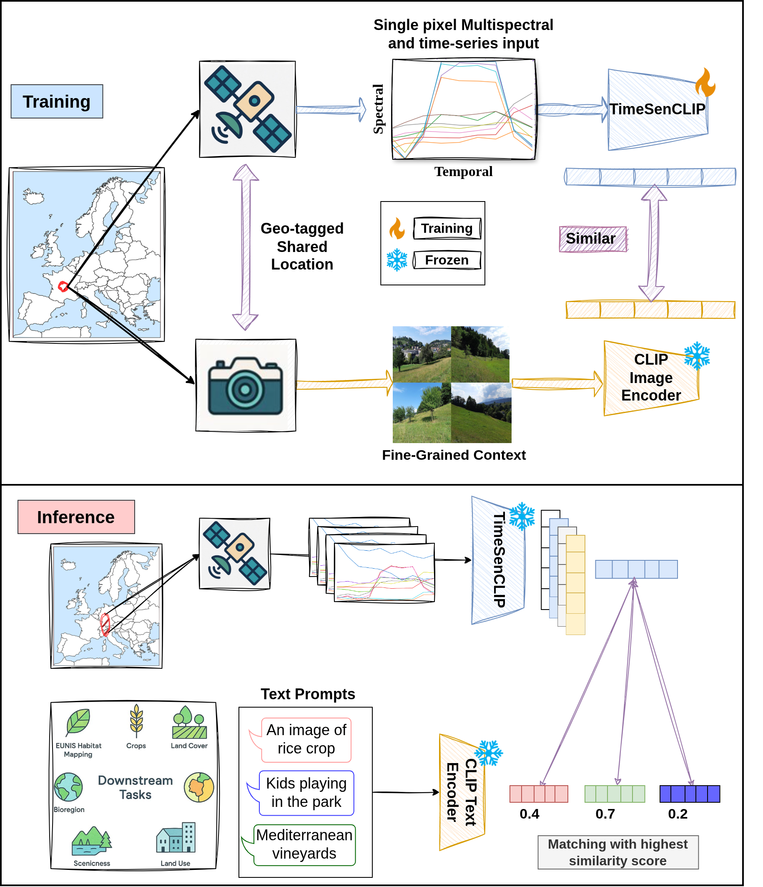

<div align="center">

# TimeSenCLIP 🛰️
### A Time Series Vision–Language Model for Remote Sensing

[](https://arxiv.org/abs/2508.11919)
[](https://doi.org/10.1016/j.isprsjprs.2026.03.043)
[](https://huggingface.co/pallavijainpj/TimeSenCLIP)
</div>

---

**TimeSenCLIP** is a lightweight vision–language model for remote sensing that revisits the need for spatial context in satellite image classification. Instead of relying on large image patches or text supervision, TimeSenCLIP explores **single-pixel inputs** enriched with **temporal** and **spectral** information from Sentinel-2 imagery, paired with **cross-view supervision** from ground-level geo-tagged images.

Built on the **[LUCAS 2018](https://ec.europa.eu/eurostat/web/lucas/database/2018)** and **[Sen4Map](https://datapub.fz-juelich.de/sen4map/)** datasets, TimeSenCLIP is evaluated on land use / land cover (LULC), crop type, and ecosystem classification. We demonstrate that, when enhanced with temporal and spectral signals, **single-pixel inputs are sufficient for robust thematic mapping** — enabling efficient, large-scale remote sensing analysis without sacrificing performance.

📄 Accepted at the [ISPRS Journal of Photogrammetry and Remote Sensing](https://doi.org/10.1016/j.isprsjprs.2026.03.043)


---
# Model Overview
<div align="center">

</div>

---

## ✨ Highlights

- **Single-pixel inputs** — no large spatial patches needed; 1×1 Sentinel-2 pixels suffice
- **Multi-temporal encoding** — processes 12-month time series across 10 spectral bands (10m and 20m)
- **Cross-view contrastive training** — aligns satellite embeddings with frozen CLIP embeddings from geo-tagged ground images
- **Zero-shot classification** — no task-specific labels required at inference

---

## 🚀 Quick Start

```python
import torch
from src.models.encoder import TimeSenCLIPEncoder

model = TimeSenCLIPEncoder(
    image_size=1, time_frames=12, dim=512,
    depth=6, heads=8, mlp_dim=256,
    spectral_bands=10, dim_head=64,
    dropout=0.2, dropout_type="None",  # no augmentation at inference
)

# Download weights from HuggingFace Hub
from huggingface_hub import hf_hub_download
ckpt = hf_hub_download(repo_id="pallavijainpj/TimeSenCLIP", filename="TimeSenCLIP_1x1.ckpt")
state_dict = torch.load(ckpt, map_location="cpu")
model.load_state_dict(state_dict, strict=True)
model.eval()

# Input: (B, T, C, H, W) — batch=4, 12 months, 10 bands, 1×1 pixel
x = torch.randn(4, 12, 10, 1, 1)
with torch.no_grad():
    emb = model.inference(x)  # (4, 512)
print(emb.shape)              # torch.Size([4, 512])              # torch.Size([4, 512])
```
---
## 🔍 Zero-shot Evaluation

```bash
bash test.sh
# or directly:
python zeroshot.py \
    --dataset_path ./data/sen4map/test.h5 \
    --checkpoint   ./checkpoints/TimeSenCLIP_TSMixAug_encoder.pt \
    --label_type   lc \
    --BATCH_SIZE   512
```
---


---
## 📄 Citation

If you use TimeSenCLIP in your research, please cite:

```bibtex
@article{jain2026timesenclip,
  title={TimeSenCLIP: A time series vision--language model for remote sensing},
  author={Jain, Pallavi and Marcos, Diego and Ienco, Dino and Interdonato, Roberto and Berchoux, Tristan},
  journal={ISPRS Journal of Photogrammetry and Remote Sensing},
  volume={236},
  pages={99--119},
  year={2026},
  publisher={Elsevier}
}
```

---
## 🔗 Related Work

Check out our related work **[SenCLIP](https://github.com/pallavijain-pj/SenCLIP)**

## Acknowledgments

<table>
  <tr>
    <td width="200">
      
    </td>
    <td>
      <sub>
      Funded by the European Union. Views and opinions expressed are however those of the author(s) only and do not necessarily reflect those of the European Union or the European Research Executive Agency. Neither the European Union nor the granting authority can be held responsible for them. UK participants in the GRANULAR project are supported by UKRI – Grant numbers 10039965 (James Hutton Institute) and 10041831 (University of Southampton).
      </sub>
    </td>
  </tr>
</table>