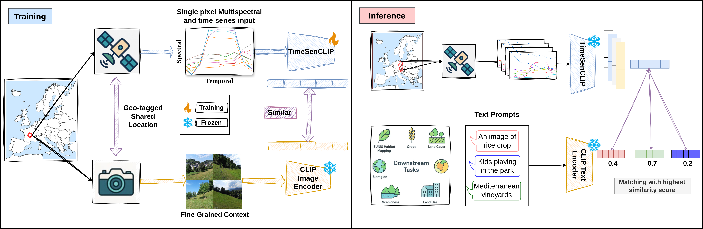

# TimeSenCLIP: A Time Series Vision-Language Model for Remote Sensing Using Single-Pixel

---

**TimeSenCLIP** is a lightweight vision-language model for remote sensing tasks that revisits the need for spatial context in satellite image classification. Instead of relying on large image patches or text supervision, TimeSenCLIP explores the use of **single-pixel inputs**, enriched with **temporal** and **spectral** information from Sentinel-2 imagery, paired with **cross-view supervision** from ground-level geo-tagged images.

Built upon the **[LUCAS 2018](https://ec.europa.eu/eurostat/web/lucas/database/2018)** and **[Sen4Map](https://datapub.fz-juelich.de/sen4map/)** datasets, TimeSenCLIP is evaluated on various classification tasks including LULC, crop type, and ecosystem type. We demonstrate that, when enhanced with temporal and spectral signals, **single-pixel inputs are sufficient for robust thematic mapping**—paving the way for efficient and large-scale remote sensing analysis without sacrificing performance.

Paper Under Review!

[Model Checkpoints 🤗 ](Soon to be released)

[Dataset 🤗 ](Soon to be released)

---
# Model Overview
<div align="center">

</div>


## 📦 Repository Structure
```text
TimeSenCLIP/
├── train.py                        # Training entry point
├── zeroshot.py                    # Zero-shot inference entry point
├── src/
│   ├── models/
│   │   ├── trainer.py             # Lightning wrapper for TimeSenCLIP
│   │   ├── encoder.py             # TimeSenCLIP image encoder
│   │   └── model.py               # Cross-View Model with Ground Level CLIP frozen embeddings ✅
│   ├── utils/
│   │   ├── dataloader.py          # Loads datasets
│   │   ├── callbacks.py           # EarlyStopping, checkpointing, etc.
│   │   └── model_utils.py         # Model weight loading utilities
|   |   ├── configs/
│         └── cli_args.py                # CLI argument parser
│   ├── Evaluation/
│   │   ├── zeroshot_train_eval.py # Zero-shot similarity scoring
│   │   └── metrics.py             # Accuracy + class-wise eval
│   └── Data/
│       ├── sen4map_data.py        # Dataloader for Sen4Map Inference
│       └── lucas_sen_data.py      # Dataset  for LUCAS-Sentinel data ✅
│       └── dataloader.py          # Dataloader to load training dataset (cross-view) and  Inference (Sen4Map test data)
```
Checkout our other work [SenCLIP](https://github.com/pallavijain-pj/SenCLIP)
